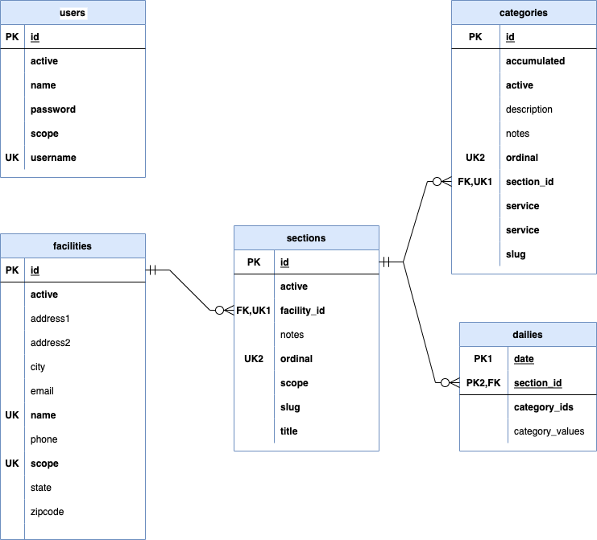

# Application Design Documentation

This document describes key architectural features of the application,
including details about:
* Database tables and relationships
* REST protocols used between client and server portions
* Internal organization of the server portion
* Internal organization of the client portion

## Background

To be most effective, developers should become familiar with the
following core technologies (the referenced links point at some canonical
information sources, but there are thousands of other resources available
on the web as well):
* [Javascript](https://javascript.info) - Programming language used on both client and server.
* [Typescript](https://www.typescriptlang.org) - Add-on capabilities that bring type safety and other features to Javascript based applications.
* [Hypertext Markup Language (HTML)](https://developer.mozilla.org/en-US/docs/Web/HTML) - HTML is the language used to create user interfaces on the client, as well as interact with Javascript/Typescript logic to enable interactivity.
* [Node.JS](https://nodejs.org) - Fundamental architecture for server side Javascript/Typescript applications.
* [React](https://reactjs.org) - Fundamental architecture for client side Javascript/Typescript applications.
* [Hypertext Transfer Protocol (HTTP)](https://developer.mozilla.org/en-US/docs/Web/HTTP/Overview) - Protocol defining how client and server environments communicate with each other.
* [Representational State Transfer (REST)](https://restfulapi.net) - Architectural style for organizing HTTP message formats (and URI destinations).  This application conforms to REST design principles.
* [Structured Query Language (SQL)](https://postgresql.org/docs/14/index.html) - SQL is the most popular standard for interacting with a database.  This application uses Postgres as its database implementation.
* [Javascript Object Notation (JSON)](https://www.json.org) - The message format used on network messages between the client and server portions of the application.  Also, very similar to the way complex objects are represented in Javascript/Typescript.
* [GitHub](https://github.com) - GitHub is the storage host for this project, as well as many thousands of others.  It features the Git repository management application, with lots of extra goodies.

## Overall Architecture

This application can be described as having four basic components:

TODO - pretty picture (with a brief thing in between each component
describing the technology used).

* **User** - Operates the interactive portion of the application using any modern web browser that supports HTML5 (including web browser capabilities on tablets and phones).
* **Client** - The portion of the application that runs inside the user's web browser. rendering HTML and executing Javascript.
* **Server** - The portion of the application that runs on a backend server, receiving network requests from the client, performing corresonding data retrieval or storage in the database, and returning results to the client.  This portion can operate on a laptop (indeed, you will be running it locally when doing development), on a server connected to a local area network, or on a cloud platform.
* **Database** - The place that data from the application is persisted, even if the application is shut down.  It executes SQL commands to perform its tasks.

## Database Tables and Relationships

### Entity-Relationship Diagram

In the diagram, the following conventions are used:
* **PK** Primary key.  For the *dailies* table, the primary key is a combination of fields.
* **UK** Unique key.  For the *sections* and *categories* tables, the unique key is a combination of fields.
* **FK** Foreign key.  Represents the primary key of a related table, which must point at an actual row.
* **Bold Column Names** identify fields with NOT NULL constraints.

### Database Tables

The tables in this database are described as follows:

| Table Name | Description                                                                                                                                                                                             |
|------------|---------------------------------------------------------------------------------------------------------------------------------------------------------------------------------------------------------|
| users      | One row for each user that is allowed to log in to this application.                                                                                                                                    |
| facilities | One row for each CityTeam Facility (currently five of them).                                                                                                                                            |
| sections   | One row for each group of statistics that will be entered together.  The list of Sections is separate for each Facility.  They are sorted by the *ordinal* value.                                       |
| categories | One row for each individual statistic.  Categories are grouped by Section, and ordered by the *ordinal* value.                                                                                          |
| dailies    | One row for all the statistics gathered for a particular Section, on a particular date.  The *category_ids* and *category_values* are arrays of ID and entered value for each Category in that Section. |

To see the detailed description of each column, the easiest approach is to
look up each table's menu option under the *Admin* menu, then click on one
of the available rows.  The descriptions will be underneath each of the fields.

### Scopes and Permissions

The information visible to (or modifiable by) particular a particular user
is defined by one or more values in the *scope* column of the *users* table.
To understand what values might be present there, we need to dig a little
deeper.

For a user to have access to any information about a particular CityTeam
*Facility*, they must have an assigned scope that has a prefix of the *scope*
for that Facility, a colon (":"), and a suffix of the *scope* for the
*Section*.  Thus, a user might be assigned scope values like this:
* **pdx:kitchen** - Access to any section with a section scope of *kitchen* for Portland.
* **oak:clothing** - Access to any section with a section scope of *clothing* for Oakland.

In addition to scope combinations for particular sections, the user must
have a general category scope for access to the facility as a whole.  Examples:
* **sfo:regular** - Regular data entry access for sections (as defined by other scopes) for San Francisco.
* **sjc:admin** - Regular access for all sections, plus ability to modify *Section* and *Category* definitions, for San Jose.

Finally, there is a "magic" scope (normally **superuser** but this can be
changed) that allows access to anything and everything for all Facilities,
including the ability to create or update users.

So, a particular user can be assigned as many permission combinations as
needed, separted by spaces in the *scope* column of the *users* table.
He or she should be assigned **{facilityScope}:regular** scope for whatever
CityTeam facility (or facilities) access is granted for, and (unless the user
has **{facilityScope}:admin** permissions), a **{facilityScope}:{sectionScope}**
permission for each *Section* he or she is allowed to enter statistics for.

## REST Protocols Between Client and Server

TODO: note about http://localhost:3000/openapi in the UI.

## Server Portion Architecture

TODO

## Client Portion Architecture

TODO
