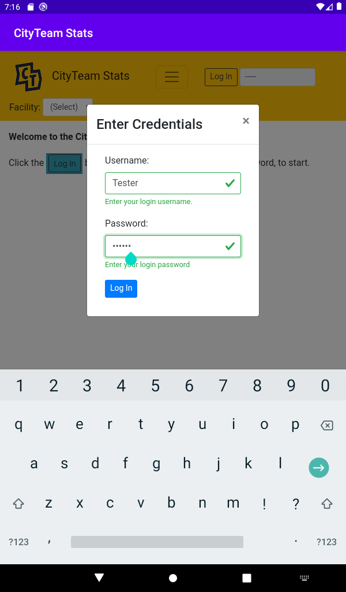
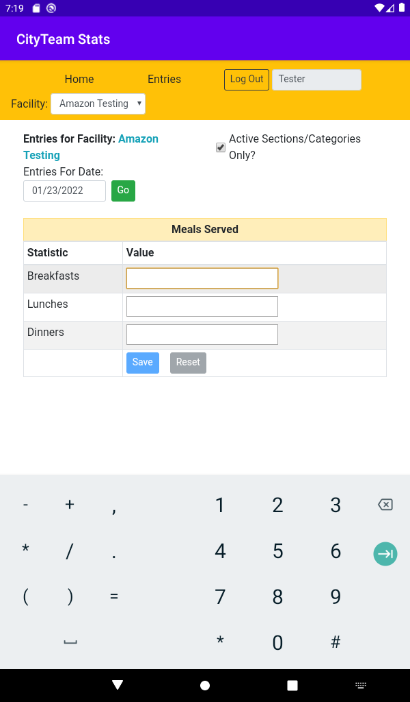

[Home](./index.md)

# CityTeam Stats Application - Information For Users

## How do I get to the application?

There are two different approaches you can use:

1. On any modern browser (either on a laptop, a tablet, or a mobile phone)
   save a bookmark to
   [https://cityteam-stats.herokuapp.com](https://cityteam-stats.herokuapp.com)
   and use the application directly.  If your CityTeam facility
   chooses to install the application locally, they will provide
   you with the appropriate URL to use).
2. On a tablet or mobile phone with access to the Amazon Appstore
   (this is built in by default on devices from Amazon), you can
   download and install this application like any other.  The
   easiest way to find it is to search for the term `cityteam`.

## OK, I'm Here, what's next?

In order to use the application, you will need to log in with the
username and password assigned to you by your local administrator.
Click (or touch, on a tablet or phone) the `Log In` button at the
top of the screen, and you will see the way to enter these
credentials:

(For these screenshots, we are showing the application as it would
appear on a tablet or phone, with the device keyboard also displayed.
If you are running the app on a laptop, you will of course be using
the actual keyboard.)

Simply enter the username and password you have been assigned,
and click (or touch) the `Log In` button.

* *Hint on mobile devices:  On many devices, the keyboard will
  default to the first character being upper cased.  If your
  username does not start with an upper case letter, be sure
  to unselect that before you start typing.*

If you have logged in successfully, the screen will change:
* The `Log In` button at the top will change to `Log Out`.
* Your username will be shown, so you can see who is logged on.
* The CityTeam Facility for which you have permission to enter
  statistics will be shown.  If you have permissions to enter
  statistics for more than one facility, this will be a dropdown
  you can use to select the right one.

## How do I actually enter the numbers?

First, click or touch the `Entries` option at the top of the screen.
You will then see an entry screen for the statistics you have
permission to enter.

Before you start entering any information, make sure that the
*Entries For Date* value is correct.  The application will
always assume that you are entering statistics for today, but
you can change that if you need to go back to some previous date.
Click on the date value, and a date selector calendar will help
you select the date you want.

The actual statistics being collected at your facility are defined
by your administrator, and are divided into *Sections* (groups of
related information), with each line item being a *Category*.  In
our example here, the section name is **Meals Served**, while the
category names are **Breakfasts**, **Lunches**, and **Dinners**.

To enter values, click or touch in the blank area for each category,
and enter the correct value for this day's total.  When you are
through with a particular section (or the only one, as was shown
in this example), click or touch `Save` to send your information
to the application's database.  *If you see more than one section,
you must click or touch `Save` for **each** of them.*

If you made a mistake, you can click or touch `Reset` to return
the values to the way they were when you entered this screen.
Or, you can simply select the value that is wrong, replace it,
and click or touch `Save` again.

That's all there is to it!

## I am done now

Click or touch the `Log Out` button at the top, so that the
next person who uses your device will be able to log in for
himself or herself.

